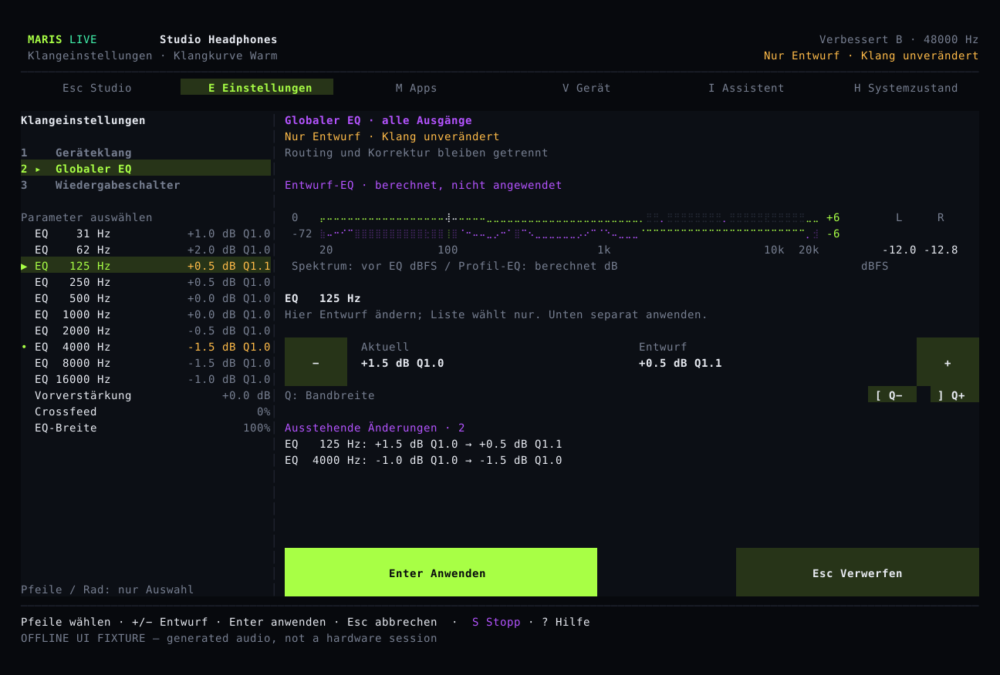
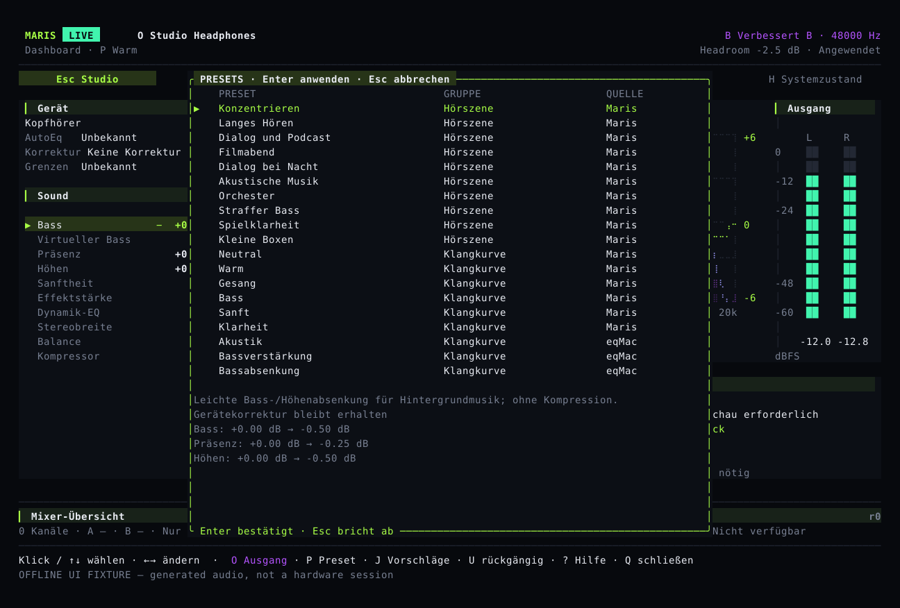

# Hören, vergleichen, zurückgehen

Studio ist für kleine Live-Anpassungen, Einstellungen sind für bewusste Konfiguration. Auswahl, Entwurf, Speicherung und Anwendung im Audioprozess sind unterschiedliche Zustände.

## Studio im Alltag {#studio}

Eine Ansicht zeigt Gerät, gemessenes Spektrum, berechneten globalen EQ, Stereopegel und Hauptparameter. Wähle eine Zeile und nutze ihre sichtbaren Minus-/Plus-Regler. Das Mausrad wählt nur aus. Fehlende oder alte Daten werden nicht durch dekorative Animationen ersetzt.

`E` öffnet Einstellungen, `P` Presets, `O` Ausgabe und `I` den Assistenten. `B` vergleicht den Klang vor und nach der Anpassung, `U` macht die letzte passende Änderung rückgängig. Ständiges Tab-Wechseln ist nicht erforderlich.

## Einstellungen als Entwurf {#settings}

Nach `E` wählt `1` den Geräteklang, `2` den globalen EQ und `3` Wiedergabeschalter. Liste, Pfeile und Mausrad dienen dem Auswählen. Der getrennte Regler verändert den Entwurf; `Enter` wendet an, `Esc` verwirft. Maus-Anwenden benötigt Drücken und Loslassen am gleichen Entwurf und Ort.



Geräteklang betrifft das ausgewählte Profil, globaler EQ alle Ausgaben. Klangbearbeitung schaltet Verarbeitung, Bypass oder Referenz nicht nebenbei um. Entwürfe vor Routing, Presets, Vergleich oder Undo abschließen. Veraltete Geräte-, Sampleraten- oder Revisionsdaten blockieren das Anwenden.

## Mit einer Szene beginnen {#scenes}

`P` bietet Hörszenen und erhaltene Maris-/eqMac-Kurven. Auswahl bedeutet noch keine Anwendung. Prüfe die endgültige, gerätebegrenzte Vorschau. Fokus, langes Hören, Dialog, Kino, Nachtdialog, Akustik, Orchester, straffer Bass, Spielklarheit und kleine Lautsprecher sind persönliche Ausgangspunkte.



Nachtdialog verringert den Unterschied zwischen lauten und leisen Stellen, ohne die Gesamtlautstärke automatisch anzuheben. Virtueller Bass braucht bekannte Gerätegrenzen. Keine Szene verspricht Gehörschutz, Surround oder bessere Spielortung. Messkorrektur, Herkunft, Hochpass, Balance und Vergleichsregeln bleiben getrennt.

## Vergleich und Undo {#compare}

A/B schätzt die Lautstärke beider Versionen und senkt die lautere ab. So wird lauter nicht so leicht mit besser verwechselt. Das ist weder eine bitgenaue Originalausgabe noch eine mit Messgeräten kalibrierte Lautstärke. Vergleiche und Änderungen ohne Wirkung erhalten die Möglichkeit, die letzte Klangänderung rückgängig zu machen. Einstellungen anderer Geräte bleiben unverändert.

## Ausgabe und Menüleiste {#output}

`O` öffnet nur die Auswahl. Erst Bestätigung ändert den eigenen Maris-Stream, nicht OS-Standard oder Systemlautstärke. Menüaktionen teilen Kontextprüfung und ausdrückliche Vorschau. Nach dem Speichern zeigt Maris an, ob die Audioverarbeitung die neuen Einstellungen bereits übernommen hat. Fallback-Code beweist keine vollständige Bluetooth-Abnahme.

## Klangvorschläge, Mixer und Sprache {#assist}

Der Assistent schlägt kleine Änderungen anhand aktueller Signaldaten, Gerätegrenzen, Korrektur und Geschmack vor und wendet sie nicht automatisch an. Enthält der Build die geprüften MusicNN-Gewichte, entstehen Musik-Tags nur im Hintergrund; veraltete oder schwache Ergebnisse und Builds ohne Modell fallen auf Signaldaten zurück, statt ein Genre zu erraten. Apps und Geräte können eigene Mixer-Eingänge erhalten. Die zwei Ausgänge haben eigene Einstellungen für Zielgerät, Lautstärke und Verzögerung. Sprach-Entrauschung wird je Kanal eingeschaltet und ist kein Standard-Musikeffekt.

Ordne Ein- und Ausgänge mit den [Mixer-Befehlen](../reference/commands.md) zu und starte den Mixer. Während er läuft, zeigt `M` die Kanäle: Auf/Ab wählt, Links/Rechts ändert den Pegel um 0,5 dB, die Leertaste schaltet stumm und `X` schaltet Solo. `[` und `]` ändern die Balance; `U` macht die letzte Mixer-Änderung rückgängig, nicht den Geräteklang. Die Spitzenpegel stammen aus Messungen. Enter ist nicht erforderlich; die Anzeige wartet trotzdem auf die Bestätigung der Audioverarbeitung. Nach einer Änderung der Ein-/Ausgänge muss der Mixer gestoppt und neu gestartet werden. Im normalen Systemaudio-Modus wählt dieselbe Seite die zu verarbeitenden Apps; Enter bestätigt die Auswahl.

```sh
maris language de
maris --lang en tui
maris mcp
maris mcp --allow-write
```

MCP ist standardmäßig nur lesend; Schreibaktionen behalten gemeinsame Prüfung, Revisionen und Undo. Gerätenamen, CLI und JSON-Schlüssel bleiben unverändert. Siehe [Freigabestatus](status.md) und die englische [Befehlsreferenz](../reference/commands.md).
