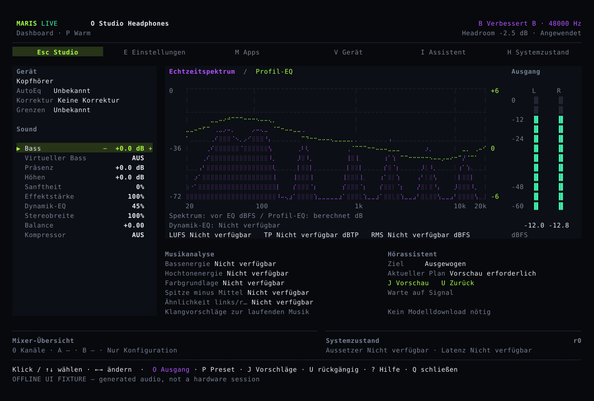

# Klang einstellen, vergleichen und zurücksetzen

Maris passt den Ton an, den dein Computer abspielt. Speichere eigene Einstellungen für Kopfhörer und Lautsprecher, wähle ein Preset und ändere Bass, Höhen und Stereobreite nach deinem Geschmack.

## Die häufigsten Regler auf einer Seite

Der Hauptbildschirm zeigt den aktuellen Ausgang, die Klangeinstellungen, das Spektrum und die Pegel beider Kanäle. Einstellungen, App-Auswahl und Diagnose lassen sich direkt öffnen.

Die Bedienung steht im [Hörleitfaden](guide.md). Der [Installer lädt ein fertiges Programmpaket](install.md); Rust ist nicht nötig. **Maris ist noch in Entwicklung. Die normale Online-Installation benötigt ein offiziell veröffentlichtes Paket.**

## Änderungen vor dem Anwenden prüfen

Wähle in den Einstellungen einen Regler und bereite die Änderung mit Minus oder Plus vor. Aktueller und geplanter Wert stehen nebeneinander. Enter wendet an, Esc verwirft. Wenn sich das Gerät oder die gespeicherten Einstellungen ändern, ist eine neue Bestätigung nötig.

## Kopfhörerkorrektur und persönlicher Klang bleiben getrennt

Die Kopfhörerkorrektur nutzt vorhandene Gerätemessungen. Bass und Höhen sind persönliche Einstellungen. Ein Klang-Preset überschreibt die Herkunft der Korrektur nicht. Das Spektrum eines Liedes kann den Kopfhörer selbst nicht vermessen.

Maris begrenzt digitale Signalspitzen. Das ist kein Gehörschutz; höre auch beim Testen mit angenehmer Lautstärke.

## Audio bleibt auf deinem Computer

Audioanalyse und MusicNN-Musikerkennung laufen lokal, ohne die ursprünglichen Audiodaten hochzuladen. Erkennungsergebnisse können Klangvorschläge unterstützen; Änderungen brauchen weiterhin deine Bestätigung. Sprach-Entrauschung ist separat und bei normaler Musik nicht eingeschaltet.

Der Quellcode enthält Systemaudio-Verarbeitung für macOS, Windows und Linux sowie einen Mixer mit mehreren Eingängen und zwei Ausgängen. Apps können eigene Kanäle für Lautstärke, EQ und Kompression verwenden. Die Bilder wurden von der App mit Testaudio erzeugt und sind keine Hörtest-Protokolle.
