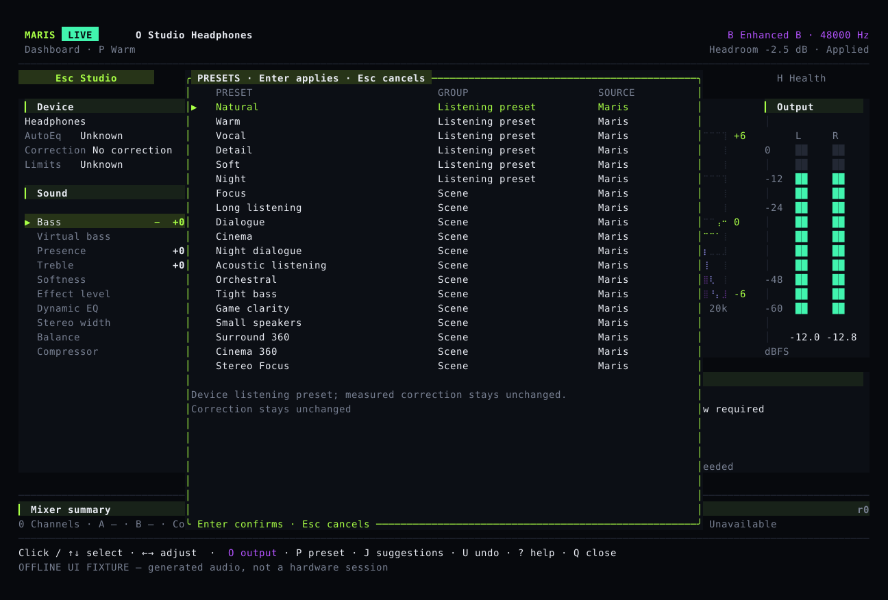

# Listening guide

Use the main screen for small adjustments while listening. Use Settings to prepare several changes before applying them. A saved change still needs confirmation from the audio processor before the screen can report it as applied.

## The main screen {#studio}

The screen shows the output device, spectrum, EQ curve, stereo levels and sound controls. The spectrum comes from the input audio; the EQ curve is calculated from settings, not measured from your headphones.

Click a parameter to select it, then use minus or plus to adjust. The wheel only changes selection. `E` opens Settings, `P` presets, `O` output selection and `I` tuning suggestions. `B` compares, `U` undoes the last relevant sound change, and `S` stops processing.

## Change settings {#settings}

After `E`, press `1` for device tone, `2` for global EQ or `3` for playback switches. Arrow keys and the wheel only browse; minus and plus change the proposed values. Enter applies and Esc cancels. With a mouse, press and release on the same Apply button.


Device tone changes the current device's settings. Global EQ affects every output. Editing tone does not turn on disabled processing or change A/B mode. Apply or cancel before changing outputs, presets or undoing. Device, sample-rate or saved-setting changes require a new confirmation.

## Choose a preset {#scenes}

`P` opens listening presets and Maris/eqMac EQ curves. Moving the selection does not change the sound. Review the changes, then press Enter. Presets such as Focus, Dialogue, Night dialogue, Orchestral and Small speakers provide starting points for your own adjustments.



Night dialogue reduces the difference between loud and quiet sounds without automatically raising the overall volume. Small-speaker virtual bass is used only when the device supports it. Presets do not provide hearing protection, surround sound or game positioning. Existing correction, high-pass filtering, balance and comparison settings are preserved.

## Compare and undo {#compare}

A/B estimates the relative level of both versions and lowers the louder one, so louder is less likely to be mistaken for better. This is not bit-perfect output or acoustically calibrated loudness matching.

Comparisons and edits that make no actual change preserve the last sound-change undo. Undoing the current device does not restore a different device's settings.

## Outputs and Menu Bar {#output}

`O` opens the output list. Only confirmation switches Maris's output; system volume and the OS default device stay unchanged. Menu Bar changes also show a confirmation.

“Saved; waiting to take effect” means the settings were stored but the audio processor has not acknowledged them. System-audio mode attempts recovery when an output disconnects.

If connecting or disconnecting power produces a harsh noise, stop processing rather than repeatedly testing with headphones on. Dropout and reconnection handling does not establish that every physical power-related problem is fixed.

## Suggestions, mixing and language {#assist}

Suggestions use the current audio, supported device settings, correction and your preferences. Previewing does not apply them. Bundled MusicNN can recognize some genres and instruments; uncertain or unavailable results leave the app using audio measurements only.

The mixer can give each app or input device its own volume, EQ and compression, then send it to two outputs. Use the [mixer commands](../reference/commands.md) to assign inputs and outputs and start mixing. Speech noise reduction must be enabled separately for each channel.

While the mixer is running, `M` opens its channels. Up/down selects a channel; left/right changes its volume by 0.5 dB; Space toggles mute; `X` plays the channel alone; `[` and `]` adjust left/right balance. `U` undoes the last mixer change, not the device's tone settings. The list also shows measured channel peaks. These controls apply without Enter, but the status remains pending until the audio processor receives the settings. Changing input/output assignments requires stopping and restarting the mixer. In ordinary system-audio mode, the same page selects which apps to process and Enter confirms that selection.

```sh
maris language zh-CN
maris --lang ja tui
maris mcp
maris mcp --allow-write
```

MCP lets other programs call Maris. It starts read-only; `--allow-write` permits changes using the same validation and undo as the interface. Device names, command names and JSON fields do not change with the display language. See the [command reference](../reference/commands.md) for details.
