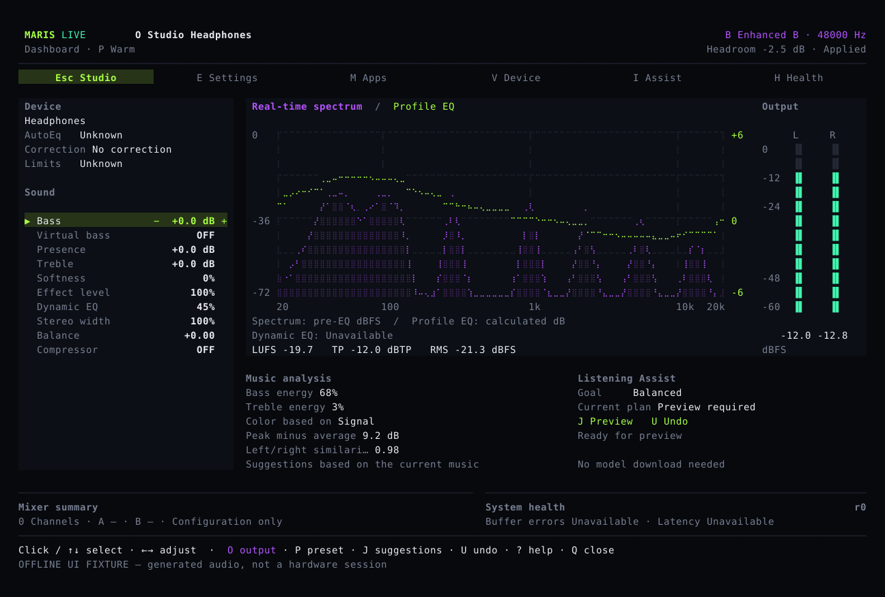
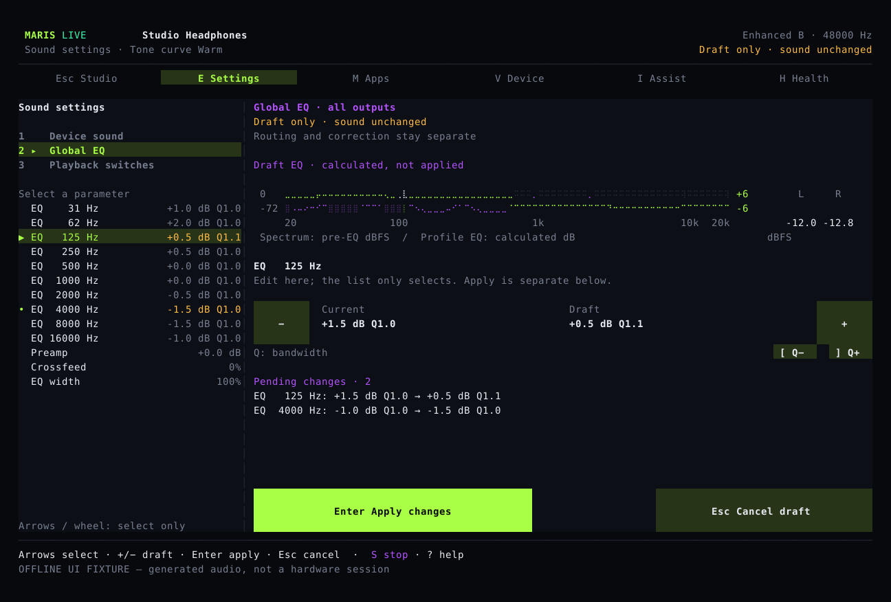
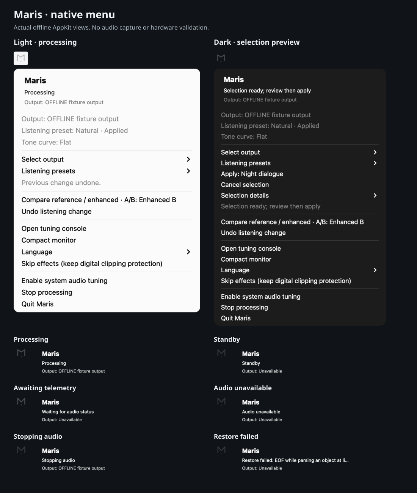

# Adjust your sound. Compare and undo.

Maris adjusts the audio playing on your computer. Save different settings for headphones and speakers, start from a preset, then adjust bass, treble and stereo width to your taste.

## Common controls on one screen

The main screen shows the current output, sound settings, spectrum and stereo levels. Open settings, app selection or diagnostics directly instead of working through a series of tabs.

See the [listening guide](guide.md) for controls. The [installer downloads a compiled package](install.md); you do not need Rust. **Maris is still in development. Online installation needs an approved published package.**

## Review settings before applying them

In Settings, select a control and use minus or plus to prepare a change. Current and proposed values appear side by side. Enter applies; Esc cancels. Changing devices or editing the saved settings elsewhere invalidates the old draft.

## Quick controls from the menu bar

The compact M follows measured audio level and stays still with Reduce Motion. Output and preset selections apply immediately; Compare and Undo remain directly available. Expired audio disables changes, and recovery failures keep their message visible.

These native views use isolated offline state, without starting or capturing audio.

## Keep headphone correction separate

Headphone correction uses existing device measurements. Bass, treble and other sound controls reflect your preferences. Choosing a preset preserves the correction source. A song's spectrum cannot measure the headphones themselves.

Maris limits digital sample peaks, but that does not protect your hearing. Keep listening volume comfortable.

## Audio stays on your computer

Audio analysis and MusicNN music recognition run locally without uploading raw audio. Recognition can help suggest small changes; those changes still need your confirmation. Speech noise reduction is separate and is not enabled for ordinary music.

The source includes macOS, Windows and Linux system-audio processing, multiple inputs and two mixer outputs. Apps can use independent channels for volume, EQ and compression. These illustrations were generated by the app using test audio, not recorded from a hardware listening test.

Maris is developed with **Wcode**.
