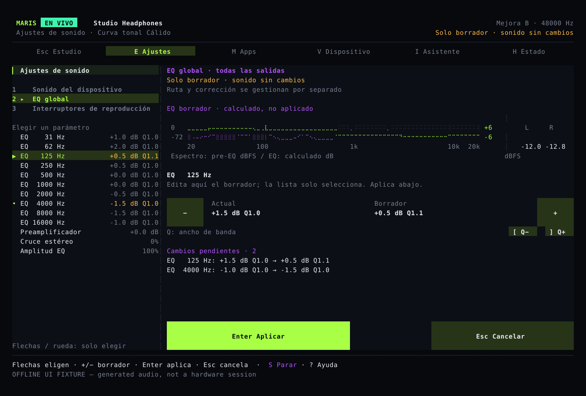
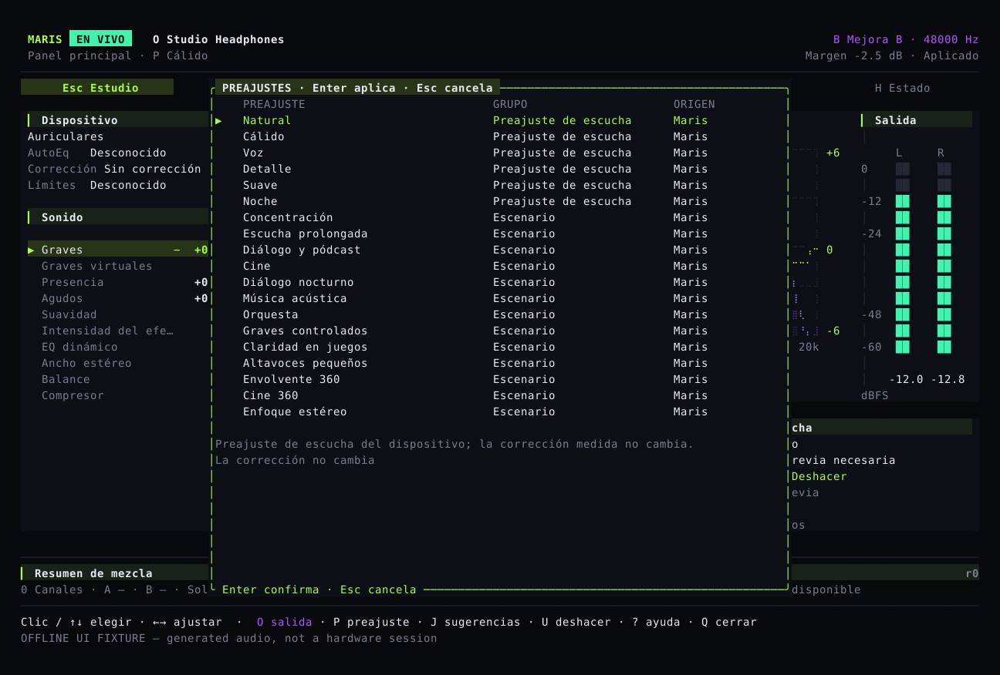

# Escuchar, comparar y poder deshacer

Studio sirve para pequeños ajustes en directo; Configuración, para cambios deliberados. Seleccionar, preparar un borrador, guardar y aplicar en el audio son estados distintos.

## Studio a diario {#studio}

Una vista muestra dispositivo, espectro medido, EQ global calculada, niveles estéreo y parámetros principales. Selecciona una fila y usa sus controles visibles de menos/más. La rueda solo selecciona: no cambia ganancia. Los datos ausentes o antiguos no se sustituyen por animaciones falsas.

`E` abre Configuración, `P` preajustes, `O` salida e `I` el asistente. `B` compara el sonido antes y después del ajuste, y `U` deshace el último cambio correspondiente. No necesitas una cadena de Tab para escuchar.

## Configurar mediante borradores {#settings}

Tras `E`, `1` elige sonido del dispositivo, `2` EQ global y `3` interruptores de reproducción. Lista, flechas y rueda solo exploran. El control separado modifica el borrador; `Enter` aplica y `Esc` cancela. Aplicar con ratón exige pulsar y soltar sobre el mismo borrador y geometría.



El sonido del dispositivo afecta al perfil elegido; la EQ global, a todas las salidas. Editar tono no activa procesamiento, bypass ni salida del modo de referencia de forma oculta. Termina o cancela antes de rutas, escenas, comparación o deshacer. Un dispositivo, frecuencia de muestreo o revisión obsoletos bloquean la aplicación.

## Empezar por una escena {#scenes}

`P` ofrece escenas y curvas Maris/eqMac conservadas. Selección no equivale a aplicación: revisa el resultado limitado por el dispositivo. Concentración, escucha larga, diálogo, cine, diálogo nocturno, acústica, orquesta, graves ajustados, claridad en juegos y altavoces pequeños son puntos de partida personales.



Diálogo nocturno reduce la diferencia entre sonidos fuertes y suaves sin subir automáticamente el volumen general. Los graves virtuales necesitan límites conocidos del dispositivo. No se promete protección auditiva, sonido envolvente ni mejor localización en juegos. Corrección, procedencia, paso alto, balance y comparación permanecen separados.

## Comparar y deshacer {#compare}

A/B estima el volumen de ambas versiones y baja el de la más fuerte para no confundir más volumen con mejor sonido. No es una salida idéntica a los datos originales ni una calibración acústica. Comparar o hacer un ajuste sin efecto conserva la opción de deshacer el último cambio de sonido. Los ajustes de otros dispositivos no se modifican.

## Salidas y barra de menús {#output}

`O` solo abre el selector. La confirmación cambia el flujo propio de Maris, no el volumen ni la salida predeterminada del sistema. El menú comparte las comprobaciones y la vista previa. Después de guardar, Maris muestra si el procesador de audio ya recibió los nuevos ajustes. El código de recuperación no certifica todos los auriculares Bluetooth.

## Sugerencias, mezclador e idioma {#assist}

El asistente propone ajustes pequeños usando señal actual, capacidades, corrección y gusto, sin aplicarlos automáticamente. Cuando la compilación incluye los pesos MusicNN verificados, las etiquetas musicales se calculan en segundo plano; resultados caducados o de baja confianza, o un modelo ausente, dejan que el programa utilice solo las mediciones de audio, sin mostrar un género incierto. Aplicaciones y dispositivos pueden usar entradas independientes del mixer. Las dos salidas permiten elegir su dispositivo, volumen y retardo por separado; la reducción de ruido de voz se activa de forma explícita por canal y no es un efecto musical predeterminado.

Asigna las entradas y salidas con los [comandos del mezclador](../reference/commands.md) y empieza la mezcla. Mientras está en marcha, `M` muestra los canales: arriba/abajo selecciona, izquierda/derecha cambia el volumen en pasos de 0,5 dB, Espacio silencia y `X` reproduce el canal en solitario. `[` y `]` ajustan el balance; `U` deshace el último cambio de mezcla, no el tono del dispositivo. Los picos mostrados son mediciones reales. No hace falta Enter, aunque el estado sigue pendiente hasta que el procesador recibe los ajustes. Cambiar entradas o salidas requiere detener y reiniciar la mezcla. En el modo normal de audio del sistema, la misma página selecciona las apps que se van a procesar y Enter confirma la selección.

```sh
maris language es
maris --lang en tui
maris mcp
maris mcp --allow-write
```

MCP es de solo lectura por defecto; las escrituras mantienen validación, revisiones y deshacer. Nombres de dispositivos, CLI y claves JSON no se traducen. Consulta el [estado de publicación](status.md) y la [referencia de comandos](../reference/commands.md) en inglés.
