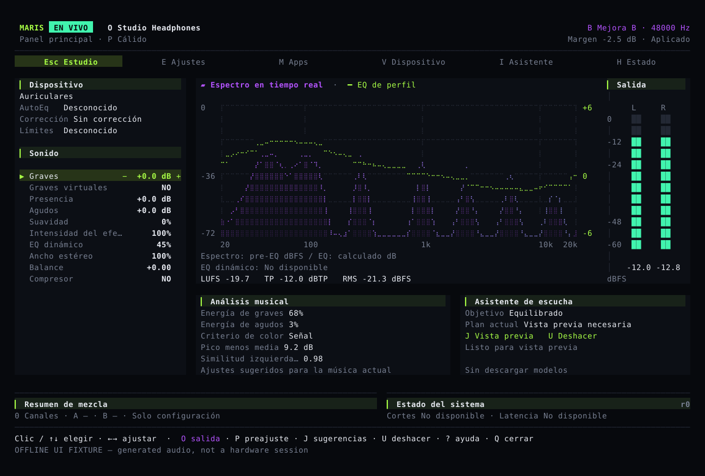

# Ajusta tu sonido, compara y deshaz

Maris ajusta el audio que reproduce tu equipo. Guarda ajustes diferentes para auriculares y altavoces, elige un preajuste y cambia los graves, agudos y amplitud estéreo a tu gusto.

## Los controles habituales en una pantalla

La pantalla principal muestra la salida actual, los ajustes de sonido, el espectro y los niveles de ambos canales. Puedes abrir directamente los ajustes, la selección de aplicaciones y el diagnóstico.

Consulta la [guía de escucha](guide.md). El [instalador descarga un paquete ya compilado](install.md); no necesitas Rust. **Maris sigue en desarrollo. La instalación en línea necesita un paquete publicado oficialmente.**

## Revisa antes de aplicar

Selecciona un control en Ajustes y usa menos o más para preparar el cambio. El valor actual y el propuesto se muestran juntos. Enter aplica y Esc cancela. Si cambia el dispositivo o alguien modifica los ajustes guardados, debes confirmar de nuevo.

## La corrección del dispositivo es independiente

La corrección de auriculares utiliza mediciones existentes del dispositivo. Los graves y agudos son preferencias personales. Elegir un preajuste conserva la procedencia de la corrección. El espectro de una canción no mide la respuesta de los propios auriculares.

Maris limita los picos de las muestras digitales, pero no protege la audición. Mantén un volumen cómodo también durante las pruebas.

## El audio se queda en tu equipo

El análisis de audio y el reconocimiento musical de MusicNN funcionan localmente sin subir el audio original. Los resultados pueden ayudar a sugerir ajustes; aplicarlos sigue requiriendo tu confirmación. La reducción de ruido de voz es independiente y no se activa para música normal.

El código incluye procesamiento de audio del sistema para macOS, Windows y Linux, además de un mezclador con varias entradas y dos salidas. Cada aplicación puede tener su propio canal con volumen, EQ y compresión. Consulta las pruebas pendientes de sistemas y dispositivos en [estado de publicación](status.md). Las imágenes proceden de la aplicación con audio de prueba generado; no son registros de pruebas de escucha con equipos físicos.
