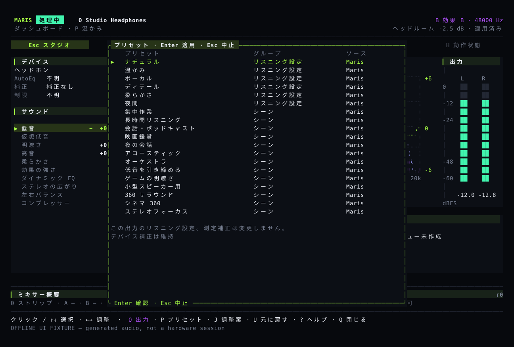

# 聴き比べて、必要なら元に戻す

Studio は小さなリアルタイム調整、設定画面は意図した構成変更のために使います。選択、下書き、保存、音声側への反映は別の状態です。

## 日常の Studio {#studio}

デバイス、実測スペクトラム、計算した全体 EQ、左右レベル、基本パラメーターを一画面に表示。行を選び、表示中のマイナス／プラスで調整します。ホイールは選択のみで、ゲインを変えません。不明・古いデータを架空のアニメーションにしません。

`E` は設定、`P` はプリセット、`O` は出力、`I` はアシストです。利用可能な画面で `B` が比較、`U` が該当領域の取り消し。Tab の連続操作は不要です。

## 設定は下書きから {#settings}

`E` の後、`1` でデバイス音色、`2` で全体 EQ、`3` で再生スイッチを選びます。リスト、矢印、ホイールは閲覧のみ。独立した調整欄で下書きを変更し、`Enter` で適用、`Esc` で取消。マウス適用は同じ下書きと位置で押下・解放する必要があります。


デバイス音色は選んだプロファイル、全体 EQ は全出力に作用します。音色編集で処理、バイパス、参照モードを黙って変えません。ルート、プリセット、比較、取り消しの前に下書きを完了してください。対象やサンプルレート、リビジョンの変化で適用を止めます。

## シーンから始める {#scenes}

`P` はシーンと既存 Maris/eqMac 曲線を表示します。選択は適用ではありません。デバイス制約後の変化を確認してから適用します。集中、長時間、会話、映画、夜間会話、アコースティック、オーケストラ、低音整理、ゲーム明瞭度、小型スピーカーは好みの出発点です。



夜間会話は大きい音と小さい音の差を縮め、全体の音量を自動では上げません。仮想低音は対応する機器でだけ使います。聴覚保護、サラウンド、ゲームの定位改善を行う機能ではありません。機器の補正とその出典、ハイパス、左右バランス、比較設定は保持します。

## 比較と取り消し {#compare}

A/B 比較は両方の音量を推定し、大きい側を下げます。単に音が大きいだけで良くなったと感じないための調整です。元のデータをそのまま出力する機能や、測定機器による音量校正ではありません。比較や実際の変化がない操作では、直前の音色変更を取り消す履歴を残します。別のデバイスの設定には影響しません。

## 出力とメニューバー {#output}

`O` を開くだけでは切り替わりません。確認後に Maris 自身の出力ストリームを変更し、OS の既定出力や音量は変えません。メニューも同じ対象検証とプレビューを使います。保存されても、音声処理側で受け取るまでは反映待ちと表示します。切断時の復帰コードだけで全ヘッドホンの実機合格とは言えません。

## 調整の提案、ミキサーと言語 {#assist}

アシストは最新信号、デバイス能力、補正、好みから小さな提案を作り、自動適用しません。検証済み MusicNN 重みを含むビルドでは音楽タグをバックグラウンドで計算し、古い結果・低信頼度・モデルなしの場合は信号情報へ戻り、ジャンルを推測しません。アプリや入力機器ごとにミキサーのチャンネルを作り、音量、EQ、圧縮を調整できます。二つの出力はそれぞれ設定できます。音声ノイズ除去は各チャンネルで個別にオンにする機能で、通常の音楽には使いません。

入力と出力を[ミキサーコマンド](../reference/commands.md)で設定して混音を開始すると、`M` にチャンネル一覧が表示されます。上下キーで選択、左右キーで音量を 0.5 dB ずつ調整、Space で消音、`X` で選択チャンネルを単独再生します。`[` と `]` は左右バランス、`U` は直前のミキサー変更を取り消します。機器の音色設定の取り消しとは別です。ピーク表示は実測値です。Enter は不要ですが、音声処理側が設定を受け取るまでは反映待ちと表示します。入出力を変更した後は、混音を停止して再起動してください。通常のシステム音声モードでは、このページで処理するアプリを選び、Enter で確定します。

```sh
maris language ja
maris --lang en tui
maris mcp
maris mcp --allow-write
```

MCP は既定で読み取り専用。書き込みも共通検証・版番号・取り消しを使います。デバイス名、CLI、JSON キーは翻訳しません。英語の[コマンドリファレンス](../reference/commands.md)をご覧ください。
