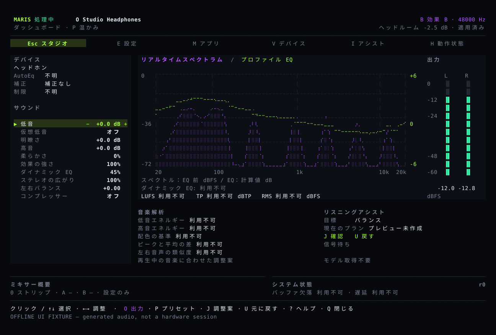
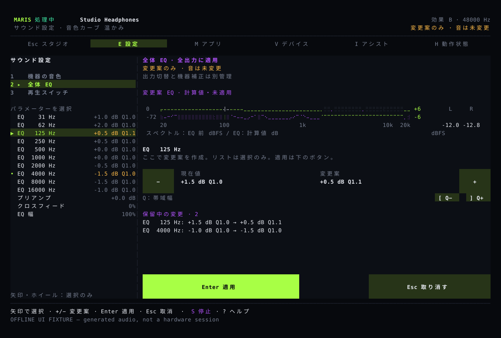

# 音を調整して、聴き比べる

Maris はコンピューターで再生する音を調整するアプリです。ヘッドホンやスピーカーごとに設定を保存し、プリセットを選んでから低音、高音、ステレオの広がりを好みに合わせられます。

## よく使う操作を同じ画面に

主画面には現在の出力、音質設定、周波数表示、左右のレベルがあります。設定、アプリ選択、動作状況を直接開けるので、複数のページを順番に移動する必要はありません。

操作は[使い方](guide.md)を参照してください。[インストーラーはコンパイル済みのアプリを取得します](install.md)。Rust は不要です。**現在は開発版です。通常のオンラインインストールには正式公開されたパッケージが必要です。**

## 確認してから適用

設定画面で項目を選び、プラスとマイナスで変更を準備します。現在の値と変更予定の値を確認し、`Enter` で適用、`Esc` で取り消します。機器や保存済みの設定が変わったときは、もう一度確認が必要です。

## 機器の補正と好みの音質を分ける

ヘッドホン補正には既存の測定データを使います。低音や高音の調整は個人の好みです。プリセットを選んでも補正の出典は保持します。曲の周波数表示だけではヘッドホン自体の特性は測れません。

デジタル音声のピークを制限しますが、聴覚を保護する機能ではありません。試聴のために音量を大きくしすぎないでください。

## 音声はコンピューター内で処理

音声解析と MusicNN による曲風・楽器の認識は本機で行い、元の音声は送信しません。認識結果は調整案に利用できますが、適用には確認が必要です。音声ノイズ除去は別途オンにする機能で、通常の音楽には使いません。

ソースには macOS、Windows、Linux のシステム音声処理と、複数入力・二つの出力のミキサーが含まれます。アプリごとに音量、EQ、圧縮を調整できます。画像はテスト音声を使ってアプリから生成したもので、実機の試聴記録ではありません。
