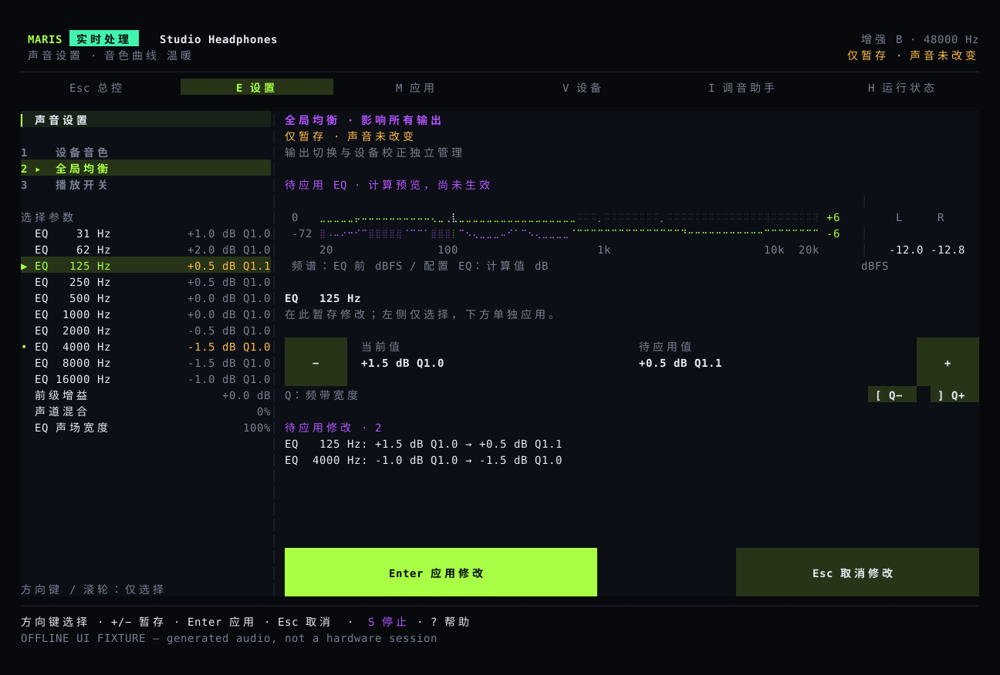
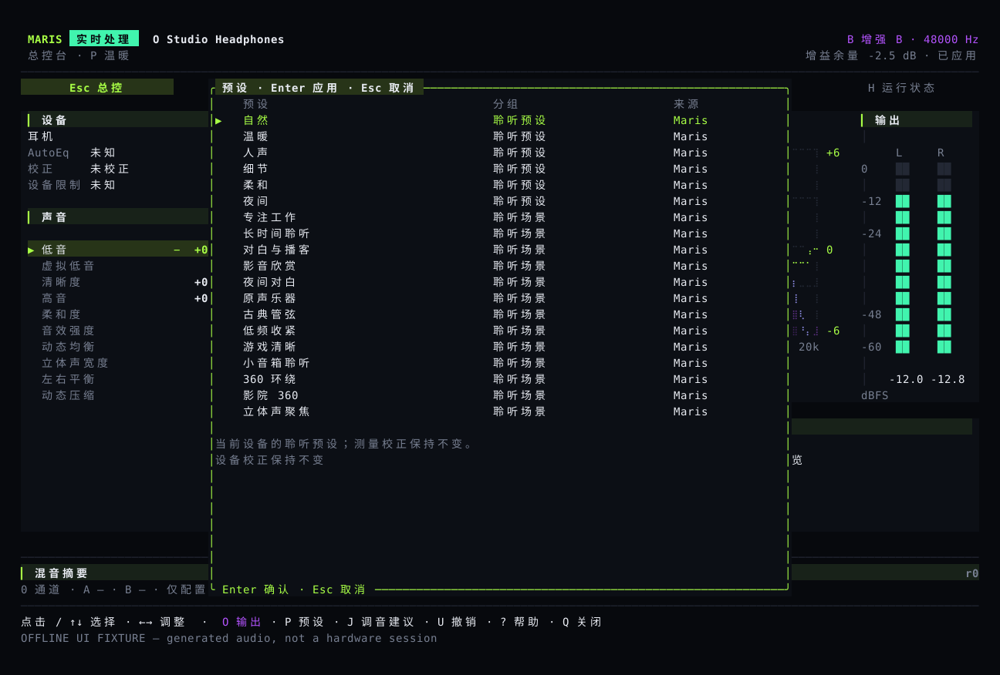

# 使用指南

主界面适合边听边微调；设置页适合一次修改多个参数，再确认应用。看到“已保存”后，还要等音频处理程序确认生效。

## 主界面 {#studio}

主界面显示输出设备、频谱、均衡曲线、左右声道电平和音色参数。频谱来自正在处理的音频；均衡曲线是根据设置计算的，不是耳机的实测曲线。

点击参数可以选中它，再点击加减号调整。滚轮只移动选择，不改音量。`E` 打开设置，`P` 打开预设，`O` 选择输出，`I` 打开调音建议。`B` 对比调整前后，`U` 撤销上一次音色修改，`S` 停止处理。

## 修改设置 {#settings}

按 `E` 后，`1` 打开设备音色，`2` 打开全局均衡，`3` 打开播放开关。方向键和滚轮只浏览；加减号修改待应用的数值。`Enter` 应用，`Esc` 取消。鼠标需要在“应用”按钮上完成一次按下和松开。



设备音色只改当前设备的设置，全局均衡会影响所有输出。修改音色不会顺带开启已关闭的处理或改变 A/B 对比状态。先应用或取消，再切换设备、选择预设或撤销。设备、采样率或保存的设置发生变化时，需要重新确认。

## 选择预设 {#scenes}

`P` 打开音色预设和 Maris/eqMac 均衡曲线。移动选中项不会改变声音；先看调整说明，再按回车确认。预设包括专注、对白、夜间对白、管弦乐和小音箱等，可作为自己调整的起点。



“夜间对白”会缩小强弱声之间的差距，不自动提高整体音量。“小音箱”的虚拟低音只在设备条件允许时使用。预设不会提供听力保护、环绕声或游戏定位功能；已有设备校正、高通滤波、左右平衡和对比设置会保留。

## 对比和撤销 {#compare}

A/B 对比会估算两侧的响度，降低较响一侧，尽量避免把“更响”误当成“更好听”。它不等于原样输出，也不是经过声学仪器校准的音量匹配。

对比和没有实际变化的操作不会占用撤销记录。撤销当前设备的音色修改，不会恢复另一台设备的设置。

## 输出设备和菜单栏 {#output}

按 `O` 打开设备列表，确认后才切换 Maris 的输出，不改变系统默认设备或系统音量。菜单栏也会先显示确认内容。

“已保存，等待生效”表示设置已经写入，但音频处理尚未确认。设备断开后，系统音频模式会尝试恢复到可用输出；具体设备和蓝牙的测试情况见[发布进度](status.md)。

插拔电源时出现刺耳声，应先停止处理，不要戴着耳机反复复现。程序增加了断流和重新连接的处理，但这不代表所有实机电源问题都已解决。

## 调音建议、混音和语言 {#assist}

调音建议参考当前音乐、设备支持的调整范围、已有校正和你的设置。预览不会自动应用。内置 MusicNN 时，程序可以识别部分曲风和乐器；结果不确定或不可用时，只使用音频分析数据。

混音器可为应用或输入设备建立独立声道，分别调整音量、均衡和压缩，再送到两路输出。先用[混音命令](../reference/commands.md)分配输入输出并启动混音；语音降噪需要逐声道开启。

混音运行时，按 `M` 打开声道列表。上下键选择声道，左右键每次调整 0.5 dB，空格切换静音，`X` 单独播放所选声道，`[` 和 `]` 调整左右平衡。`U` 撤销上一次混音修改，不会撤销设备音色。列表中的峰值来自实际测量。这些操作不需要回车确认；音频处理接收到修改前，状态仍显示等待生效。更换输入输出后，需要停止并重新启动混音。普通系统音频模式下，同一页面用于勾选要处理的应用，回车确认选择。

```sh
maris language zh-CN
maris --lang ja tui
maris mcp
maris mcp --allow-write
```

MCP 是供其他程序调用的接口，默认只能读取状态；加 `--allow-write` 后才允许修改。它使用和界面相同的设置检查与撤销方式。设备名称、命令和 JSON 字段不会随界面语言改变。详细命令见[命令参考](../reference/commands.md)。
