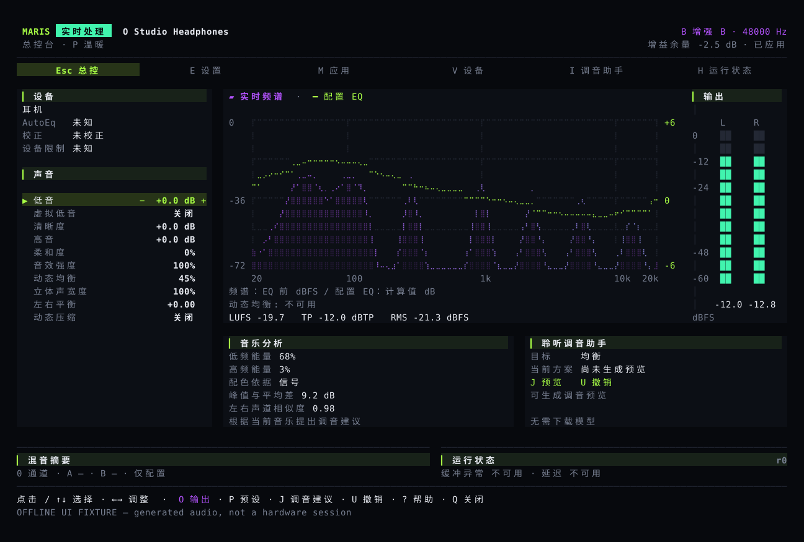
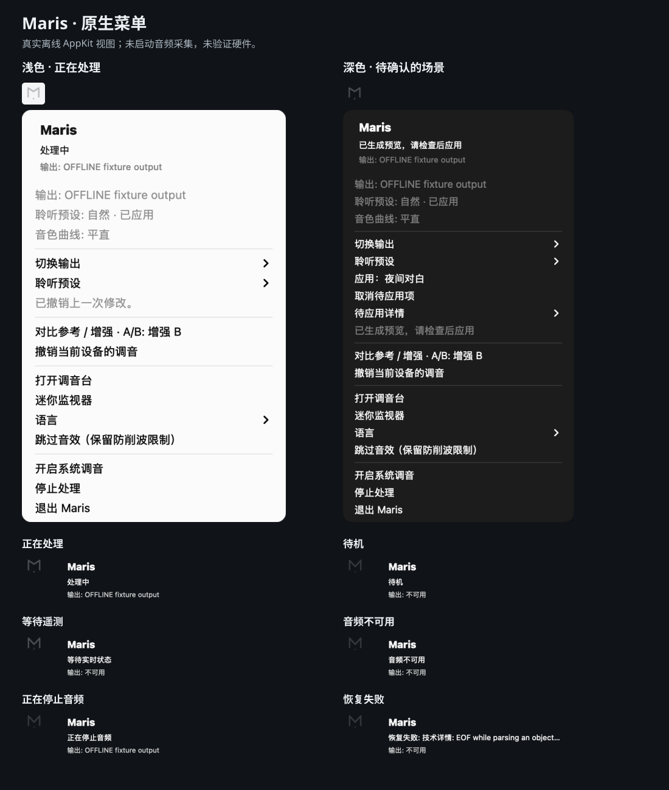

# 调整音色，随时对比和撤销

Maris 用来调整电脑播放的声音。你可以给不同耳机和音箱保存各自的设置，选择预设，再按自己的喜好调整低音、高音和立体声宽度。

## 常用功能放在一页

主界面显示当前输出设备、音色设置、频谱和左右声道电平。设置、应用选择和运行详情可以直接打开，不必依次切换多页。

操作见[使用指南](guide.md)。[安装器下载编译好的安装包](install.md)，普通用户不需要安装 Rust。**目前仍是开发版本，在线安装需要正式发布的安装包。**

## 设置确认后才生效

在设置页，先选择参数，再用加减号调整。当前值和待应用值会同时显示。按 `Enter` 应用，按 `Esc` 放弃；切换设备或设置被其他程序修改后，旧的修改不能直接提交。

## 从菜单栏快速调音

小巧的 M 标记随实际音频电平变化，开启“减少动态效果”后保持静止。选择输出或预设后会立即生效，对比和撤销可以直接操作。音频状态过期时会禁用修改，恢复失败时保留错误提示。

这些原生界面使用独立的离线状态渲染，没有启动或采集音频。

## 耳机校正和个人音色分开保存

耳机校正使用已有的设备测量数据；低音、高音等调整是个人喜好。选择音色预设不会覆盖校正的来源。歌曲的频谱不能测出耳机本身的频率响应。

Maris 会限制数字音频的峰值，但这不能保护听力。不要为了试音把音量开得很大。

## 音频留在本机

音乐分析和 MusicNN 的曲风、乐器识别在本机运行，不上传原始音频。识别结果可用于调音建议，建议需要确认后才应用。语音降噪需要单独开启，不是音乐播放的默认效果。

代码包含 macOS、Windows 和 Linux 的系统音频处理，以及多个输入和两路输出的混音。应用可使用独立通道调整音量、均衡和压缩。本页配图由程序使用测试音频生成，不是实机试听记录。

Maris 使用 **Wcode** 开发。
