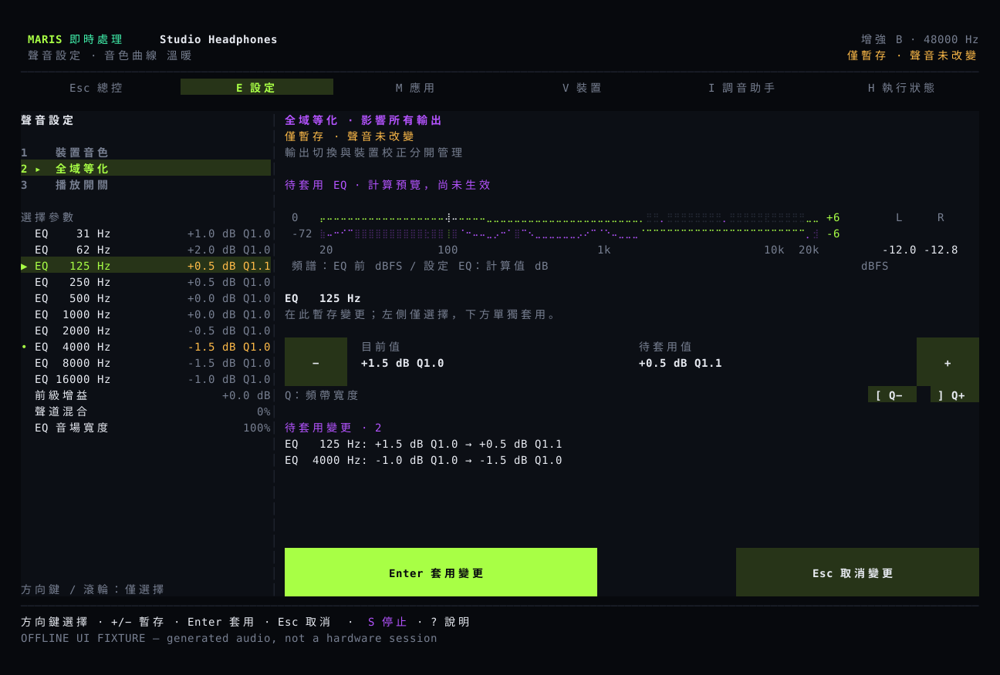
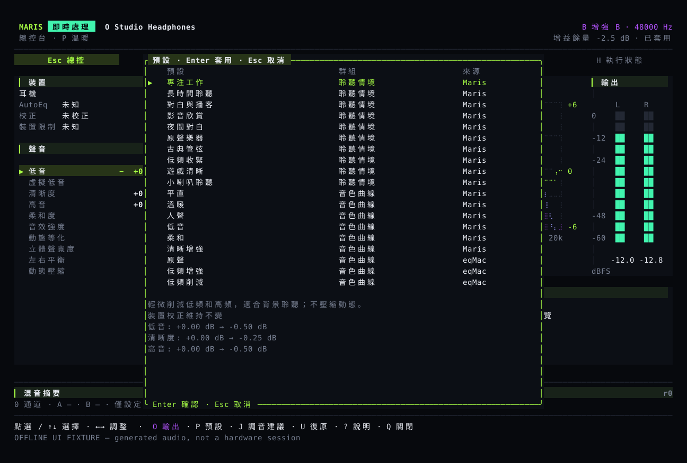

# 使用指南

主畫面適合邊聽邊微調；設定頁適合一次修改多個參數，再確認套用。看到「已儲存」後，仍要等待音訊處理程式確認生效。

## 主畫面 {#studio}

主畫面顯示輸出裝置、頻譜、等化曲線、左右聲道電平和音色參數。頻譜來自輸入音訊；等化曲線依設定計算，不是耳機的實測曲線。

點選參數，再用加減號調整。滾輪只改選擇，不改音量。`E` 開啟設定，`P` 開啟預設，`O` 選擇輸出，`I` 開啟調音建議。`B` 比較調整前後，`U` 復原上一次相關音色修改，`S` 停止處理。

## 修改設定 {#settings}

按 `E` 後，`1` 開啟裝置音色，`2` 開啟全域等化，`3` 開啟播放開關。方向鍵和滾輪只瀏覽；加減號修改待套用的數值。`Enter` 套用，`Esc` 取消。滑鼠需要在「套用」按鈕上完成按下和放開。



裝置音色只改目前裝置的設定，全域等化會影響所有輸出。修改音色不會順便開啟已關閉的處理或改變 A/B 狀態。先套用或取消，再切換裝置、選擇預設或復原。裝置、取樣率或已儲存設定變更時，需要重新確認。

## 選擇預設 {#scenes}

`P` 開啟音色預設和 Maris/eqMac 等化曲線。移動選擇不會改變聲音；先看調整說明，再按 Enter。專注、對白、夜間對白、管弦樂和小喇叭等預設，都可以作為自行調整的起點。



夜間對白會縮小強弱聲之間的差距，不自動提高整體音量。小喇叭的虛擬低音只在裝置條件允許時使用。預設不提供聽力保護、環繞聲或遊戲定位功能；原有校正、高通濾波、左右平衡和比較設定會保留。

## 比較和復原 {#compare}

A/B 估算兩側的響度，降低較響一側，盡量避免把「更響」誤當成「更好聽」。它不是原始資料直接輸出，也不是經過聲學儀器校準的音量匹配。

比較和沒有實際變化的操作不會占用復原紀錄。復原目前裝置的音色，不會改動另一台裝置的設定。

## 輸出裝置和選單列 {#output}

按 `O` 開啟裝置列表，確認後才切換 Maris 的輸出，不改變系統預設裝置或音量。選單列也會先顯示確認內容。

「已儲存，等待生效」表示設定已寫入，但音訊處理尚未確認。裝置斷開後，系統音訊模式會嘗試恢復到可用輸出。

插拔電源時出現刺耳聲，請先停止處理，不要戴著耳機反覆測試。斷流和重新連接的處理，不代表所有實機電源問題都已解決。

## 調音建議、混音和語言 {#assist}

調音建議參考目前音樂、裝置支援的調整範圍、校正和你的設定。預覽不會自動套用。內含 MusicNN 時可以辨識部分曲風和樂器；結果不確定或不可用時，只使用音訊分析資料。

混音器可為應用程式或輸入裝置建立獨立聲道，分別調整音量、等化和壓縮，再送到兩路輸出。先用[混音命令](../reference/commands.md)分配輸入輸出並啟動混音；語音降噪需逐聲道開啟。

混音執行時，按 `M` 開啟聲道列表。上下鍵選擇聲道，左右鍵每次調整 0.5 dB，空白鍵切換靜音，`X` 單獨播放所選聲道，`[` 和 `]` 調整左右平衡。`U` 復原上一次混音變更，不會復原裝置音色。列表中的峰值來自實際測量。這些操作不需要 Enter 確認；音訊處理收到變更前，狀態仍顯示等待生效。更換輸入輸出後，需要停止並重新啟動混音。一般系統音訊模式下，同一頁面用於勾選要處理的應用程式，Enter 確認選擇。

```sh
maris language zh-TW
maris --lang ja tui
maris mcp
maris mcp --allow-write
```

MCP 供其他程式呼叫，預設只能讀取狀態。加 `--allow-write` 後才允許修改，並使用與介面相同的檢查和復原。裝置名稱、命令和 JSON 欄位不隨介面語言改變。
