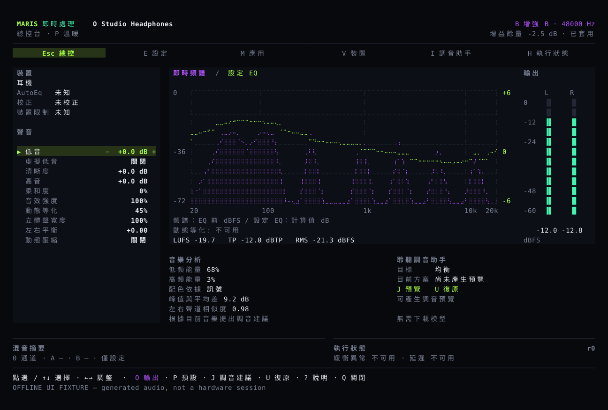

# 調整音色，隨時比較和復原

Maris 用來調整電腦播放的聲音。耳機和喇叭可以各自儲存設定，再依喜好調整低音、高音和立體聲寬度。

## 常用功能放在同一頁

主畫面顯示目前輸出、音色設定、頻譜和左右聲道電平。設定、應用程式選擇和執行詳情可以直接開啟，不必依序切換多頁。

操作方式見[使用指南](guide.md)。[安裝程式下載編譯好的安裝包](install.md)，一般使用者不需要 Rust。**目前仍是開發版本；線上安裝需要已正式發布的安裝包。**

## 確認後才套用設定

先選擇參數，再用加減號調整。畫面會同時顯示目前值和待套用值。`Enter` 套用，`Esc` 取消。裝置或已儲存的設定變更時，需要重新確認。

## 裝置校正與個人音色分開儲存

耳機校正使用已有的裝置測量資料；低音、高音等調整則是個人喜好。選擇預設不會覆蓋校正的來源。歌曲的頻譜不能測出耳機本身的頻率響應。

程式會限制數位音訊峰值，但不能保護聽力。不要為了試音將音量開得很大。

## 音訊留在本機

音訊分析和 MusicNN 音樂辨識在本機執行，不上傳原始音訊。辨識結果可以協助提出調音建議，但需要確認後才套用。語音降噪需要單獨開啟，不是音樂的預設效果。

程式碼包含 macOS、Windows 和 Linux 的系統音訊處理，以及多個輸入、兩路輸出的混音。各應用程式可用獨立通道調整音量、等化和壓縮。本頁圖片由程式使用測試音訊產生，不是實機試聽紀錄。
